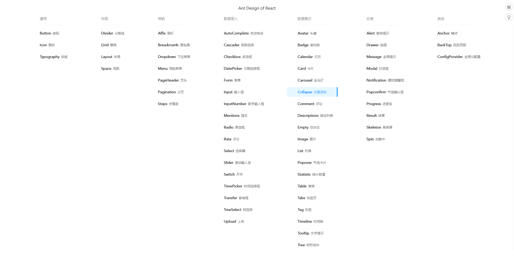

# antd

`antd` 是基于 Ant Design 设计体系的 React UI 组件库，主要用于研发企业级中后台产品。

Ant Design React 致力于提供给程序员愉悦的开发体验。

## ✨ 特性

🌈 提炼自企业级中后台产品的交互语言和视觉风格。

📦 开箱即用的高质量 React 组件。

🛡 使用 TypeScript 开发，提供完整的类型定义文件。

⚙️ 全链路开发和设计工具体系。

🌍 数十个国际化语言支持。

🎨 深入每个细节的主题定制能力。

## 📌 组件列表
 

### 解决问题

 CURD代表创建（Create）、更新（Update）、读取（Retrieve）和删除（Delete）操作。

## 🏆 用法

### 引入antd

<code src="./antd/demo-01.tsx" />

### 普通表单

<code src="./antd/demo-02.tsx" />

### 时间组件

<code src="./antd/demo-03.tsx" />

### 弹窗

<code src="./antd/demo-04.tsx" />

### 自动完成

<code src="./antd/demo-05.tsx" />

### 分页

<code src="./antd/demo-07.tsx" />

### 表格

<code src="./antd/demo-06.tsx" />