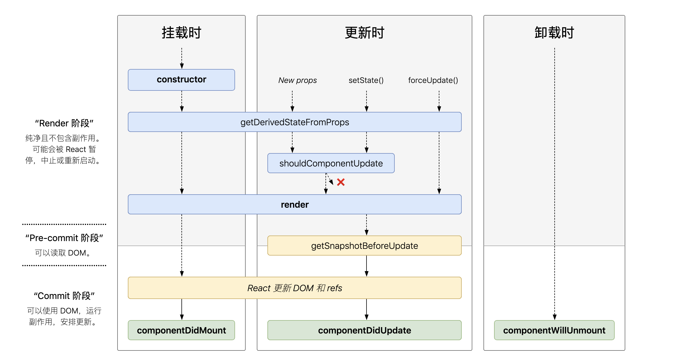

# react

`React 是用 JavaScript 构建快速响应的大型 Web 应用程序的首选方式。`

## 入门 react

<code src="./react/demo-01.tsx" />

## jsx

<code src="./react/demo-02.tsx" />

这个有趣的标签语法既不是字符串也不是 HTML。

它被称为 JSX，是一个 JavaScript 的语法扩展。我们建议在 React 中配合使用 JSX，JSX 可以很好地描述 UI 应该呈现出它应有交互的本质形式。JSX 可能会使人联想到模版语言，但它具有 JavaScript 的全部功能。

## 组件 & Props
<code  src="./react/demo-05.tsx" />

组件，从概念上类似于 JavaScript 函数。它接受任意的入参（即 “props”），并返回用于描述页面展示内容的 React 元素。

## State & 生命周期

<code  src="./react/demo-06.tsx" />

- 当 Clock 的输出被插入到 DOM 中后，React 就会调用 ComponentDidMount() 生命周期方法。在这个方法中，Clock 组件向浏览器请求设置一个计时器来每秒调用一次组件的 tick() 方法。
- 浏览器每秒都会调用一次 tick() 方法。 在这方法之中，Clock 组件会通过调用 setState() 来计划进行一次 UI 更新。得益于 setState() 的调用，React 能够知道 state 已经改变了，然后会重新调用 render() 方法来确定页面上该显示什么。这一次，render() 方法中的 this.state.date 就不一样了，如此以来就会渲染输出更新过的时间。React 也会相应的更新 DOM。
- 一旦 Clock 组件从 DOM 中被移除，React 就会调用 componentWillUnmount() 生命周期方法，这样计时器就停止了。


### state 和 props 之间的区别是什么？
props（“properties” 的缩写）和 state 都是普通的 JavaScript 对象。它们都是用来保存信息的，这些信息可以控制组件的渲染输出，而它们的一个重要的不同点就是：props 是传递给组件的（类似于函数的形参），而 state 是在组件内被组件自己管理的（类似于在一个函数内声明的变量）。

## [组件的生命周期](https://zh-hans.reactjs.org/docs/react-component.html#the-component-lifecycle)

 

### 挂载
当组件实例被创建并插入 DOM 中时，其生命周期调用顺序如下：

- constructor()
- static getDerivedStateFromProps()
- render()
- componentDidMount()

### 更新
当组件的 props 或 state 发生变化时会触发更新。组件更新的生命周期调用顺序如下：

- static getDerivedStateFromProps()
- shouldComponentUpdate()
- render()
- getSnapshotBeforeUpdate()
- componentDidUpdate()

### 卸载
当组件从 DOM 中移除时会调用如下方法：

- componentWillUnmount()


## react hooks

Hook 是 React 16.8 的新增特性。它可以让你在不编写 class 的情况下使用 state 以及其他的 React 特性。

Hook 解决了我们五年来编写和维护成千上万的组件时遇到的各种各样看起来不相关的问题。无论你正在学习 React，或每天使用，或者更愿尝试另一个和 React 有相似组件模型的框架，你都可能对这些问题似曾相识。

- 在组件之间复用状态逻辑很难
   - Hook 使你在无需修改组件结构的情况下复用状态逻辑。
- 复杂组件变得难以理解
   - Hook 将组件中相互关联的部分拆分成更小的函数（比如设置订阅或请求数据）
- 难以理解的 class
  -  Hook 使你在非 class 的情况下可以使用更多的 React 特性。

### useState

<code src="./react/demo-03.tsx" />

#### 调用 useState 方法的时候做了什么?
 它定义一个 “state 变量”。我们的变量叫 count， 但是我们可以叫他任何名字，比如 banana。这是一种在函数调用时保存变量的方式 —— useState 是一种新方法，它与 class 里面的 this.state 提供的功能完全相同。一般来说，在函数退出后变量就会”消失”，而 state 中的变量会被 React 保留。

#### useState 需要哪些参数？ 
useState() 方法里面唯一的参数就是初始 state。不同于 class 的是，我们可以按照需要使用数字或字符串对其进行赋值，而不一定是对象。在示例中，只需使用数字来记录用户点击次数，所以我们传了 0 作为变量的初始 state。（如果我们想要在 state 中存储两个不同的变量，只需调用 useState() 两次即可。）

#### useState 方法的返回值是什么？
 返回值为：当前 state 以及更新 state 的函数。这就是我们写 const [count, setCount] = useState() 的原因。这与 class 里面 this.state.count 和 this.setState 类似，唯一区别就是你需要成对的获取它们。如果你不熟悉我们使用的语法，我们会在本章节的底部介绍它。


### useEffect

<code src="./react/demo-04.tsx" />

useEffect 就是一个 Effect Hook，给函数组件增加了操作副作用的能力。它跟 class 组件中的 componentDidMount、componentDidUpdate 和 componentWillUnmount 具有相同的用途，只不过被合并成了一个 API。


#### useEffect 做了什么？ 
通过使用这个 Hook，你可以告诉 React 组件需要在渲染后执行某些操作。React 会保存你传递的函数（我们将它称之为 “effect”），并且在执行 DOM 更新之后调用它。在这个 effect 中，我们设置了 document 的 title 属性，不过我们也可以执行数据获取或调用其他命令式的 API。

#### 为什么在组件内部调用 useEffect？
 将 useEffect 放在组件内部让我们可以在 effect 中直接访问 count state 变量（或其他 props）。我们不需要特殊的 API 来读取它 —— 它已经保存在函数作用域中。Hook 使用了 JavaScript 的闭包机制，而不用在 JavaScript 已经提供了解决方案的情况下，还引入特定的 React API。

####useEffect 会在每次渲染后都执行吗？ 
是的，默认情况下，它在第一次渲染之后和每次更新之后都会执行。（我们稍后会谈到如何控制它。）你可能会更容易接受 effect 发生在“渲染之后”这种概念，不用再去考虑“挂载”还是“更新”。React 保证了每次运行 effect 的同时，DOM 都已经更新完毕。

### useMemo

```ts
const memoizedValue = useMemo(() => computeExpensiveValue(a, b), [a, b]);
```

返回一个 memoized 值。

把“创建”函数和依赖项数组作为参数传入 useMemo，它仅会在某个依赖项改变时才重新计算 memoized 值。这种优化有助于避免在每次渲染时都进行高开销的计算。

如果没有提供依赖项数组，useMemo 在每次渲染时都会计算新的值。

### useCallback

```ts
const memoizedCallback = useCallback(
  () => {
    doSomething(a, b);
  },
  [a, b],
);
```

返回一个 memoized 回调函数。

把内联回调函数及依赖项数组作为参数传入 useCallback，它将返回该回调函数的 memoized 版本，该回调函数仅在某个依赖项改变时才会更新。当你把回调函数传递给经过优化的并使用引用相等性去避免非必要渲染（例如 shouldComponentUpdate）的子组件时，它将非常有用。

useCallback(fn, deps) 相当于 useMemo(() => fn, deps)。


### useRef

<code src="./react/demo-07.tsx" />

useRef 返回一个可变的 ref 对象，其 .current 属性被初始化为传入的参数（initialValue）。返回的 ref 对象在组件的整个生命周期内保持不变。

当 ref 对象内容发生变化时，useRef 并不会通知你。变更 .current 属性不会引发组件重新渲染。如果想要在 React 绑定或解绑 DOM 节点的 ref 时运行某些代码，则需要使用回调 ref 来实现。


